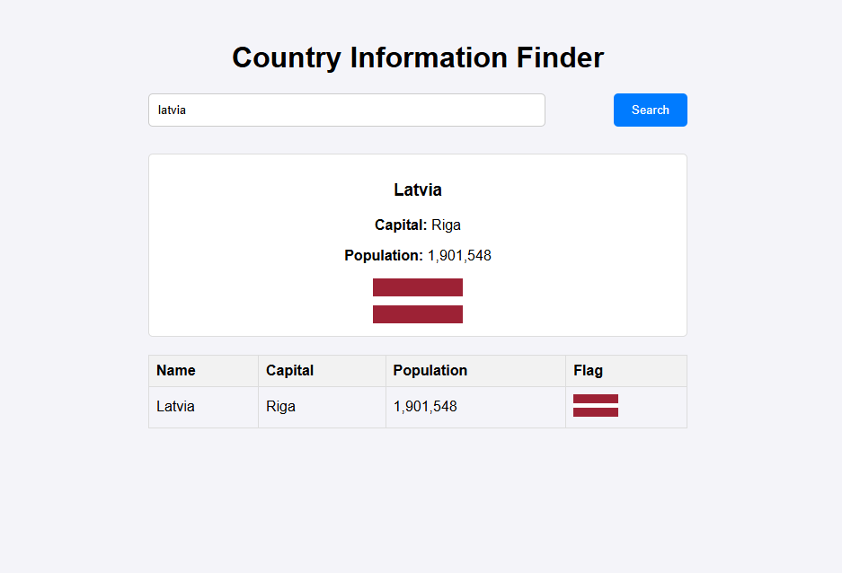

# Frontend Test Task - Country Information Finder

This is a single-page web application that retrieves data from the REST Countries API and displays it in two formats: card view and table view.
Users can search for a country by name and see its details, including the name, capital, population, and flag.

## Features

-Search for a country by name.

-Display results in two formats:

-Card View : Each country is displayed as a card with details.

-Table View : Results are displayed in a structured table format.

-Proper error handling for invalid input or API errors.

-Responsive design for better user experience.

## Technologies Used

-HTML : Structure of the application.
-CSS : Styling for the UI.
-JavaScript : Fetching data from the REST Countries API using fetch.
-Vue.js : Framework for reactive and dynamic rendering.

## API Used

- **REST Countries API**: [https://restcountries.com/](https://restcountries.com/)
- Endpoint: `https://restcountries.com/v3.1/name/{countryName}`

## How to Run the Project

Clone the project repository using Git:

```sh
git clone https://github.com/AlexPlec/CountriesInformationFinder.git
```

Then, navigate into the project directory:

```sh
cd CountriesInformationFinder
```

## Implementation Details

This project includes two implementations:

1. **JavaScript Implementation (`JS` folder)**:
   - A vanilla JavaScript version without any frameworks.
   - Ideal for understanding basic DOM manipulation and API integration.

2. **Vue.js Implementation (`Vue` folder)**:
   - A Vue.js version with reactive data binding and component-based architecture.
   - Suitable for showcasing modern frontend development practices.

if you want to run JS 

```sh
cd JS
```

Open the index.html file in your browser

if you want to run Vue

```sh
cd Vue
```

Open the index.html file in your browser

## Screenshots

